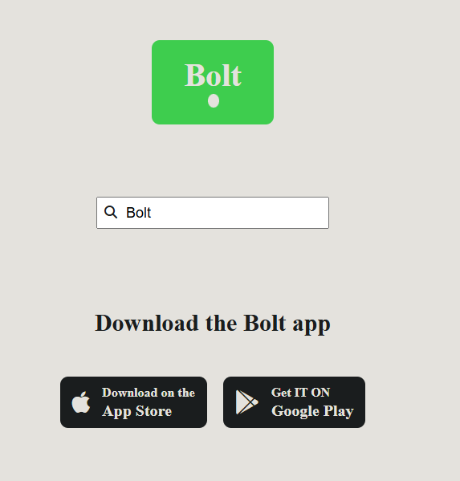

# 🚖 Bolt Advertisement | MuradDev

This project simulates the frontend of an app like **Bolt**. It is developed using HTML, CSS and JavaScript. The main goal is to create a visually appealing and interactive advertising interface.

---

## 🔍 Description

The project has the following main parts:
- **Poster**: Bolt logo and animation effect.
- **Search input**: With auto-fill effect (JavaScript is used).
- **Download buttons**: Buttons designed for App Store and Google Play.

---

## 📸 Screenshot
 

---

## 🛠 Technologies

- **HTML5** – For structure
- **CSS3** – For style and animations
- **JavaScript** – For dynamic effect (text effect)
- **Font Awesome** – For icons
- **Google Fonts** – Fonts

---

## 🚀 How to use it?

1. Clone the repository:
```bash
git clone https://github.com/MuradIsazade777/Bolt-Advertisement.git
